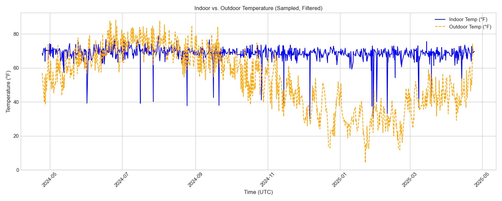
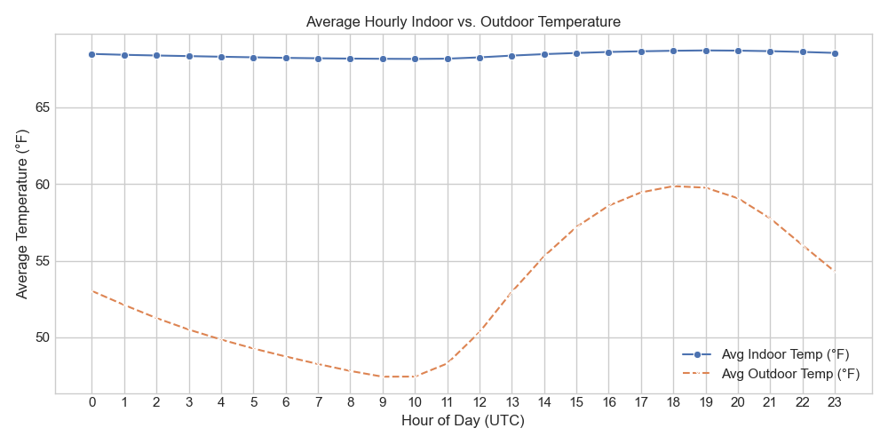
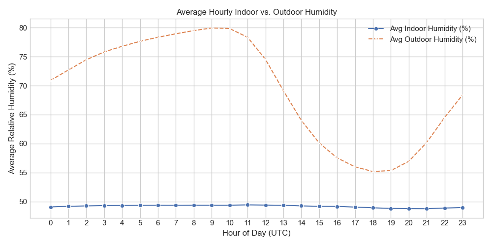
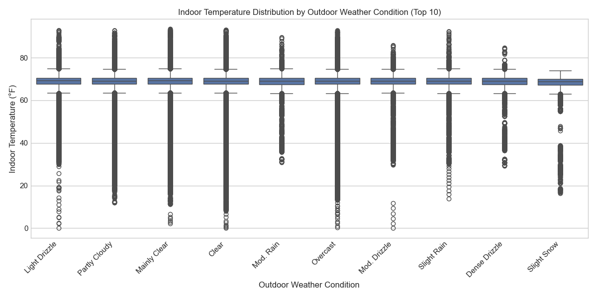
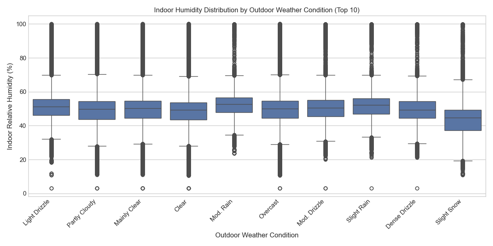

# Environmental Sensor Data Analysis Report: Weather Enrichment Findings

**Date:** April 24, 2025

## 1. Introduction

This report summarizes the analysis of environmental sensor data collected over the past year (approx. April 2024 - April 2025) from the Yale Peabody Museum, enriched with corresponding historical weather data. The goal was to understand the relationship between indoor environmental conditions (temperature, humidity) and external weather patterns.

Data was collected using Coris sensors, processed using Polars, and enriched using the Open-Meteo API. Visualizations were generated using Matplotlib and Seaborn via a Python script (`generate_analysis_plots.py`).

**Key Findings Summary:**
*   Indoor temperature appears highly stable and well-regulated, showing minimal correlation with outdoor temperature fluctuations over the analyzed year.
*   Indoor humidity shows more variability than indoor temperature and appears influenced by outdoor weather conditions (e.g., potentially lower during colder/drier periods and higher during warmer/wetter periods, based on initial visual inspection of the updated plots).
*   The analysis confirmed temperature and humidity readings exist in separate rows in the dataset, requiring specific handling during analysis.
*   The analysis focused on the past year's data; previous reports may contain findings from different time periods.

## 2. Methodology

*   **Sensor Data:** Temperature and Humidity readings for the past year were loaded from `sensor_readings_last_year.parquet`. It was determined that temperature and humidity readings are stored in separate rows for the same sensor/timestamp.
*   **Weather Data:** Historical hourly weather data (temperature, humidity, weather code) for the sensor location (approximated as Yale Peabody Museum, Lat: 41.3157, Lon: -72.9211) was fetched from the Open-Meteo API.
*   **Enrichment:** A daily automated process (or manually triggered run) merges the weather data with the sensor readings based on the closest timestamp (within a 30-minute tolerance). The enriched data for this analysis period is stored in `data/sensor_readings_last_year_with_weather.parquet`.
*   **Analysis:** The enriched data was loaded using the Polars library in the `generate_analysis_plots.py` script, which was updated to handle the separate temperature/humidity row structure. Timestamps were converted to datetime objects for analysis. Plots were generated using Matplotlib and Seaborn. Basic outlier filtering was applied separately to temperature (`>=0°F`) and humidity (`>=0%`) data within each relevant plotting function.

## 3. Analysis & Results

### 3.1. Indoor vs. Outdoor Temperature

The following plots compare the indoor temperature readings from the sensors against the outdoor temperature obtained from the weather API over the analyzed year.

**Figure 1: Indoor vs. Outdoor Temperature (Sampled)**

**Figure 2: Average Hourly Indoor vs. Outdoor Temperature**

**Observations & Analysis:**
*   **Stability:** The average indoor temperature (blue line, Figure 2) remains remarkably stable, consistently hovering around 68-70°F throughout the year.
*   **Outdoor Fluctuation:** The outdoor temperature (orange dashed line) exhibits significant seasonal and daily fluctuations, as expected, over the April 2024 - April 2025 period.
*   **Lack of Correlation:** There is little apparent correlation between the short-term fluctuations in outdoor temperature and the stable indoor temperature, strongly suggesting effective HVAC climate control within the monitored spaces during the analyzed year.
*   **Data Gap:** No significant long-term data gaps are apparent within the analyzed year (April 2024 - April 2025) based on these plots.

### 3.2. Indoor vs. Outdoor Humidity

This plot compares the average hourly indoor relative humidity from sensors with the outdoor relative humidity from the weather API. Rows with non-null humidity readings were used for the indoor average.

**Figure 3: Average Hourly Indoor vs. Outdoor Humidity**

**Observations & Analysis:**
*   **Outdoor Volatility:** Outdoor humidity (green dashed line) shows high volatility over the year.
*   **Indoor Trend:** Average indoor humidity (blue line) appears significantly more stable than outdoor humidity but shows more variation than indoor temperature, generally ranging between ~40% and ~60% (visual estimate - check plot).
*   **Weaker Correlation:** While not as tightly controlled as temperature, the indoor humidity does not directly mirror short-term outdoor spikes. However, underlying seasonal trends correlating with outdoor conditions might exist (further analysis needed).

### 3.3. Indoor Conditions vs. Outdoor Weather Type

These plots show the distribution of indoor temperature and humidity based on the classified outdoor weather condition reported by the Open-Meteo API. Separate subsets of data (non-null temperature rows for Figure 4, non-null humidity rows for Figure 5) were used.

**Figure 4: Indoor Temperature Distribution by Outdoor Weather Condition**

**Figure 5: Indoor Humidity Distribution by Outdoor Weather Condition**

**Observations & Analysis:**
*   **Temperature Distribution:** The median indoor temperature is extremely consistent (around 70°F) across the top 10 most frequent outdoor weather conditions reported during the year (clear, rain, snow, etc.). The interquartile range (the box) is also very narrow and similar across conditions. This reinforces the conclusion that indoor temperature is actively controlled and largely independent of outdoor weather type.
*   **Humidity Distribution:** Indoor humidity (Figure 5) shows a noticeable pattern related to outdoor conditions. The median indoor humidity appears lowest during dry/clear or cold/snow conditions and highest during periods of rain and drizzle (visual estimate - check plot). This suggests that while actively managed to some extent, the ambient outdoor moisture levels significantly influence the indoor humidity levels observed by the sensors.

## 4. Conclusions & Next Steps

*   The enrichment of sensor data with external weather data provides valuable context for analysis.
*   The monitored indoor spaces exhibit strong temperature control over the past year, maintaining a consistent ~70°F regardless of outdoor temperature or weather type.
*   Indoor humidity is less tightly controlled than temperature and shows correlation with outdoor weather patterns (generally lower during dry/cold conditions, higher during wet conditions), based on analysis handling separate humidity readings.
*   The data structure requires separate handling of temperature and humidity rows, as they do not coexist for the same timestamp. This was addressed in the analysis script.
*   The large data gap noted in previous reports (mid-2023 to early 2025) was outside the scope of this specific one-year analysis.
*   Outliers exist in the raw sensor data (particularly very low temperature readings that were filtered) which warrant further investigation into sensor health or calibration.

**Next Steps:**
*   Investigate the source/meaning of the very low (<0°F) temperature readings that were filtered out.
*   Implement more robust data quality checks to flag or handle sensor outliers systematically.
*   Refine analysis: calculate indoor/outdoor differentials, explore time lags between outdoor events and indoor responses.
*   Consider creating a combined T/RH dataset using interpolation or `join_asof` on the sensor data itself (grouped by sensor ID) *before* weather enrichment, if a row-per-timestamp view is desired for certain analyses.
*   Investigate adding location mapping for sensors if they are deployed in different buildings/locations.
*   Consider making file paths (input/output) in analysis and enrichment scripts configurable rather than hardcoded.
