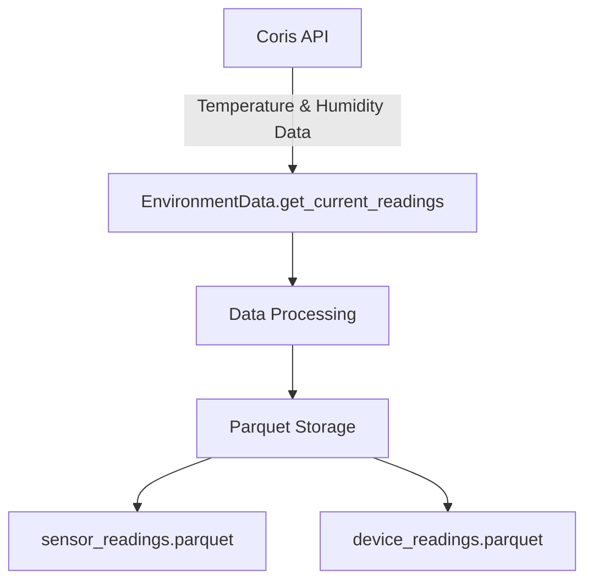
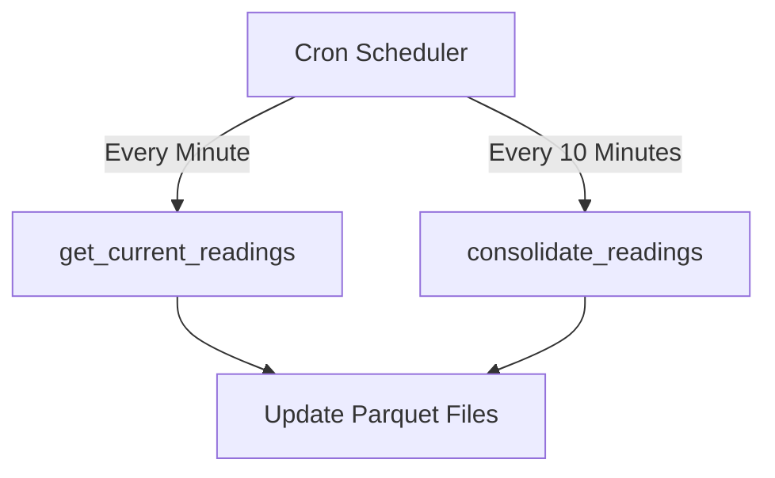
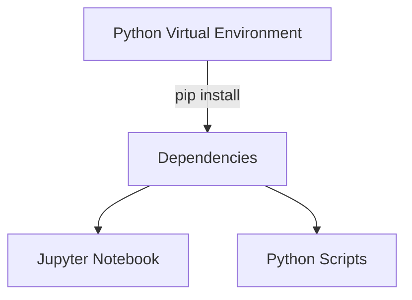
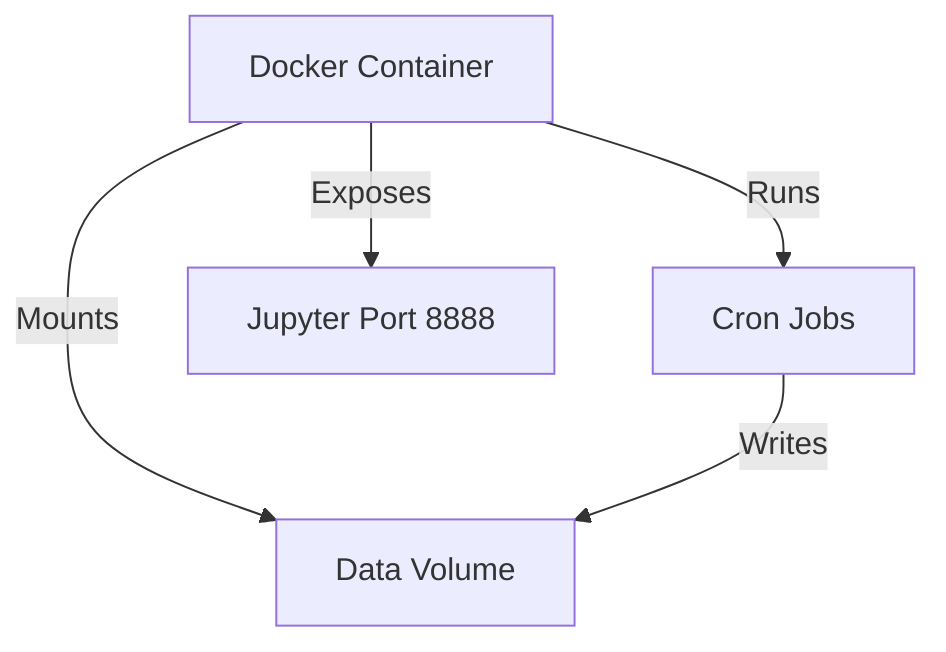

# Technical Architecture

## Core Classes and Components

### EnvironmentData Class
The central class managing all data operations:
- Initialization and database setup
- Real-time data collection
- Historical data retrieval
- Data consolidation
- Sensor management

## Data Flow

### 1. Data Collection Flow


### 2. Scheduled Operations


## File Structure
```
project_root/
├── EnvironmentData.py     # Main class implementation
├── requirements.txt       # Python dependencies
├── Dockerfile            # Container configuration
├── .env                  # Configuration and secrets
├── jobs/
│   └── cronjobs         # Scheduled task definitions
├── test/
│   └── run.py           # Test suite
├── html/
│   └── EnvironmentData.html  # Generated documentation
└── examples/
    ├── examples-cron.ipynb
    └── examples-analysis.ipynb
```

## API Integration

### Coris API Endpoints
1. **User Endpoint**
   - URL: `cats/user`
   - Purpose: Retrieve all sensor readings and IDs
   - Parameters: ApiKey, CatsUserID

2. **Historical Data Endpoint**
   - URL: `sensor/historical`
   - Purpose: Historical readings for specific sensors
   - Parameters: ApiKey, SensorID, ReadingType, StartUTC, EndUTC

## Data Storage Schema

### sensor_readings.parquet
- SensorID_Coris (primary key)
- Temperature/Humidity readings
- Timestamp information
- Sensor metadata

### device_readings.parquet
- DeviceID_Coris (primary key)
- Device-level aggregations
- Status information

## Configuration Management
- Environment variables via .env file
- Configurable parameters:
  * DAYS_BACK: Historical data range
  * TESTING: Test mode flag
  * API credentials
  * Sensor type mappings

## Deployment Architecture

### Local Development


### Docker Deployment


## Testing Strategy
- Unit tests in test/
- Test mode for limited sensor scope
- Configurable historical data range
- Automated test execution 